<h1 align="center"> REST - WordPress Template </h1>

<!--ts-->
- [Sobre](#sobre)
- [Começando](#começando)

  - [Pré-requisitos](#pre-requisitos)

- [Instalação](#instalação)

  - [Criando projeto no Local](#criando-projeto-no-local)
  - [Clonando e ativando o template](#clonando-e-ativando-o-template)
  - [Instalando Pluggins](#instalando-pluggins)
  - [Criando as Pages](#criando-as-pages)
  - [Criando Menu](#criando-menu)
  - [Configuração de tela inicial](#configuração-de-tela-inicial)

* [Usando Theme](#usando-theme)
* [Tecnologias](#tecnologias)
<!--te-->
<hr>

# Sobre
Este projeto foi desenvolvido durante o curso de WordPress como Content Management System (CMS) da Origamid. O objetivo é proporcionar uma compreensão básica sobre o WordPress, demonstrando sua utilidade na manutenção de um site como um sistema CMS com o qual o cliente teria controle sobre o conteudo do site.

## Começando

As instruções abaixo vão permitir que seja possivel ver e testar o template localmente.

### Pre-requisitos

Para total funcionamento do projeto algumas coisas seram necessarias. Um programa para a utilização do Wordpress e dois plugins para criar e gerenciar os custom fields da onde vem os dados que são exibidos no site.

- Programa:
  - [Local](https://localwp.com/) - principal programa atualmente no desenvolvimento local de Wordpress
- Plugins:
  - [CMB2](https://cmb2.io/docs/home) - Plugin para o desenvolvimento de custom fields. Quase todos os campos do site foram feitos com ele
  - [Carbon Fields](https://carbonfields.net/) - Plugin complementar para o desenvolvimento de custom fields. Agiu como um pluggin complementar para subrir algumas necessidades que o CMB2 não atendia

## Instalação

### Criando projeto no Local

Com o **Local** instalado siga os passos abaixo para criar um novo projeto.

#### 1° - Passo

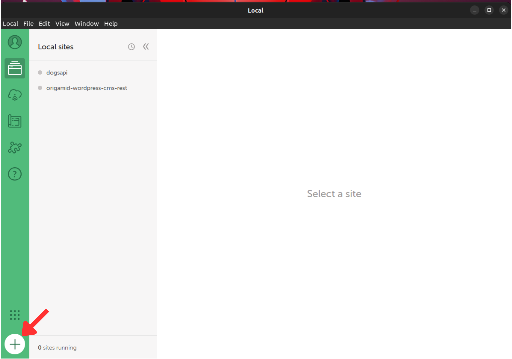

#### 2° - Passo

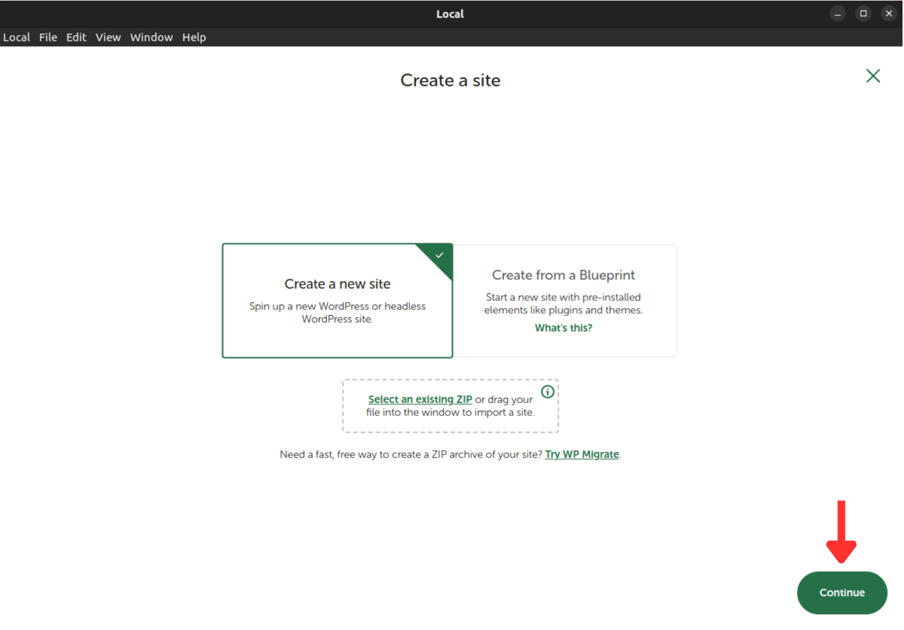

#### 3° - Passo

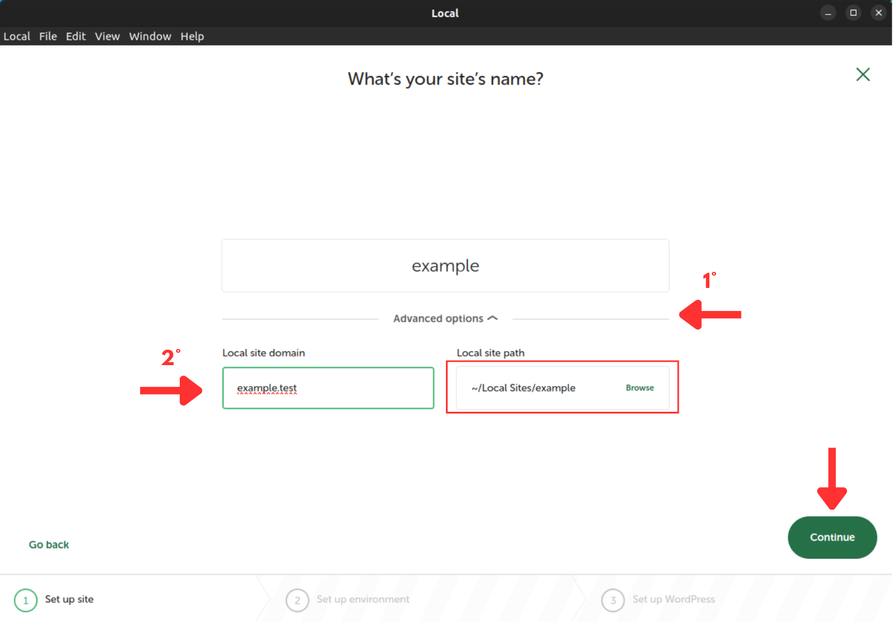

  <p>1° - Abra a parte de configurações avançadas</p>
  <p>2° - Mude de .local para .test o <b>Local site dominium</b> assim você evitara qualquer tipo de conflito com programas que já estejam rodando em sua maquina.</p>
  <p><b>OBS</b>: Guarde o <b>Local site Path</b> vai ser necessario depos.Você pode alterar caso queira.</p>

#### 4° - Passo

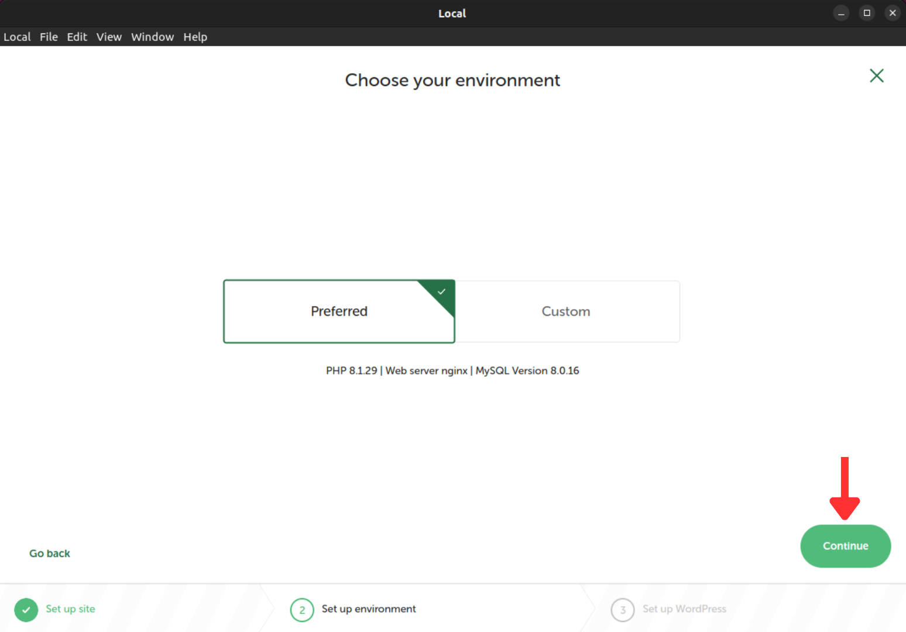

#### 5° - Passo

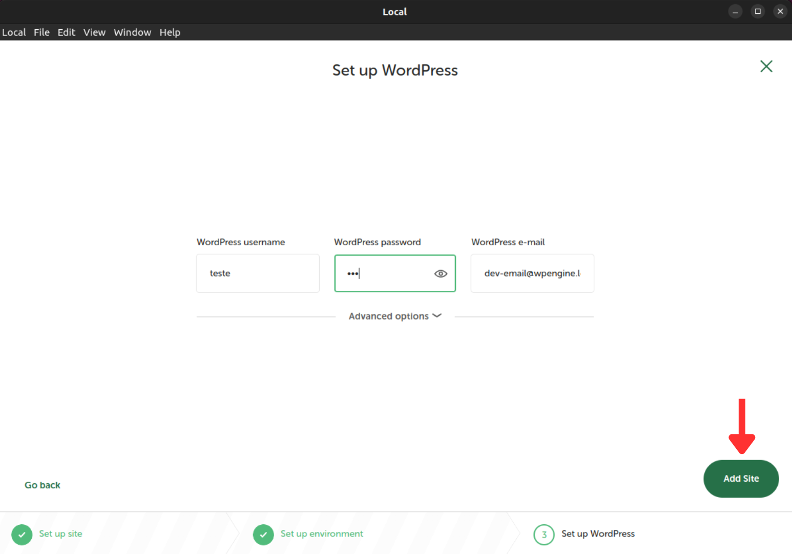

Depois de criar o projeto acesse a area de admin do Wordpress com o usuario e senha que foram criados durante o 5° passo

### Clonando e ativando o template

Acessando o local a onde o projeto foi criado - **Local site Path** - faça um clone desse repositorio dentro da pasta themes.

```bash
app/public/wp-content/themes
```

Após feito isso dentro da aba de themes da área de admin do Wordpress o tema do Rest já vai esar disponivel.

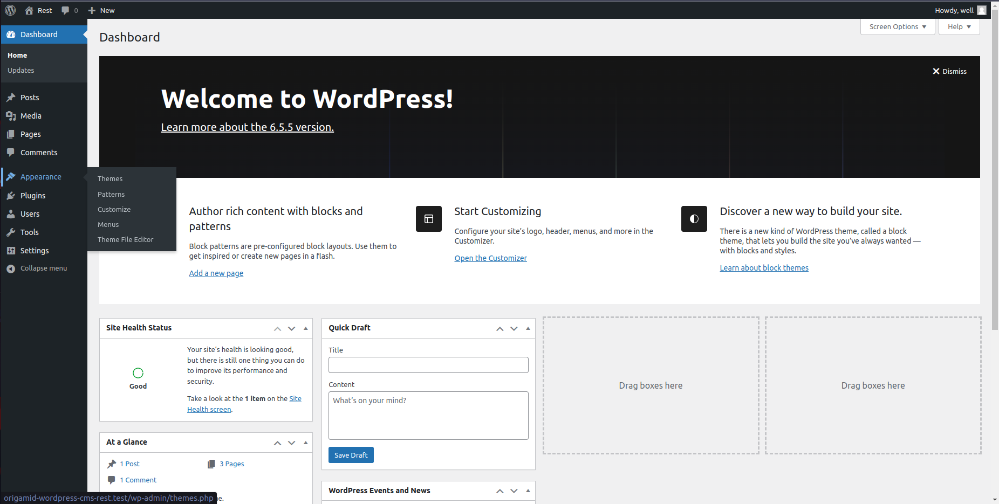
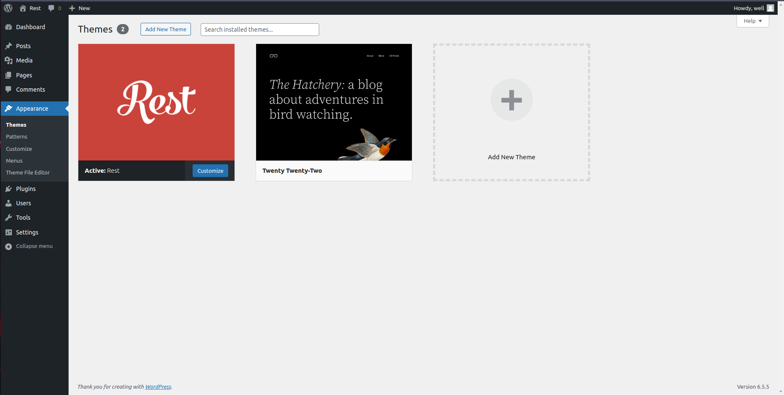

Ative o Thema para que sei site passe a possuir a aparencia do Rest.

Depois de ativar o Theme do Rest algumas configurações ainda precisam ser feitas para que seja possivel ter acesso a todas as funcionalidades do theme.

### Instalando Pluggins

Dois Pluggins são necessarios para a parte de CMS da do Wordpress funcionar e por isso é preciso adicionalos primeiro

- **CMB2** -> Na aba de Pluggins ao acessar a aba de **Add new Pluggin** pesquise por CMB2 e clique em instalar no primeiro que aparecer
  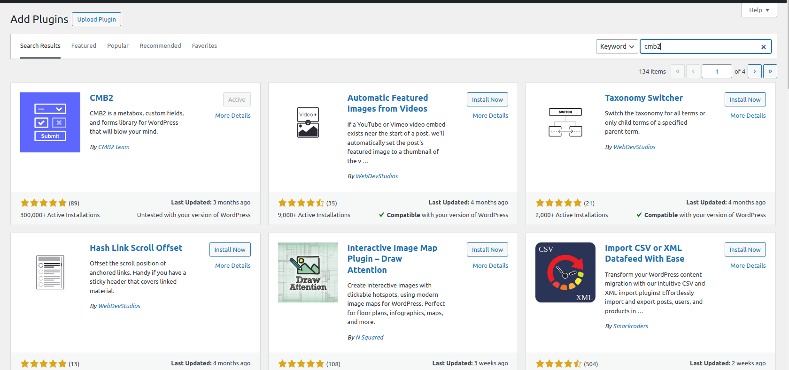

- **Carbon Fields** -> O pluggin do Carbon Fields não esta disponivel na loja, por isso é necessario fazer o download do arquivo e importalo para o Wordpress é possivel fazer seguindo a passo a passo na pripria [documentação](https://docs.carbonfields.net/plugin-quickstart.html#without-composer) do pluggin.

### Criando as Pages

Sera nescessario que você crie 3 pages - Menu da Semana, Sobre e Contato - setanto cata uma delas com seus respectivos templates.

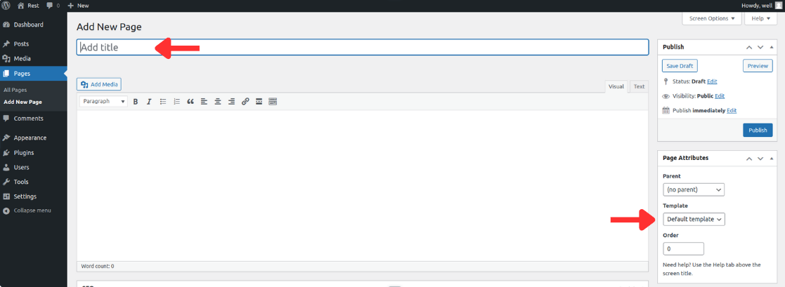

Selecione o Template correto de acordo com o nome que for atribuido ao titulo da pagina.

### Criando Menu

Para que o Menu do header funcione, primeiro é necessario crialo dentro da aba de **Appearance->Menus** esse menu vai substituir a lista de menu que geralmente criamos ao criar uma pagina html. Selecionamos todas as pages que queremos que façam parte do menu e assim o Wordpress o cria

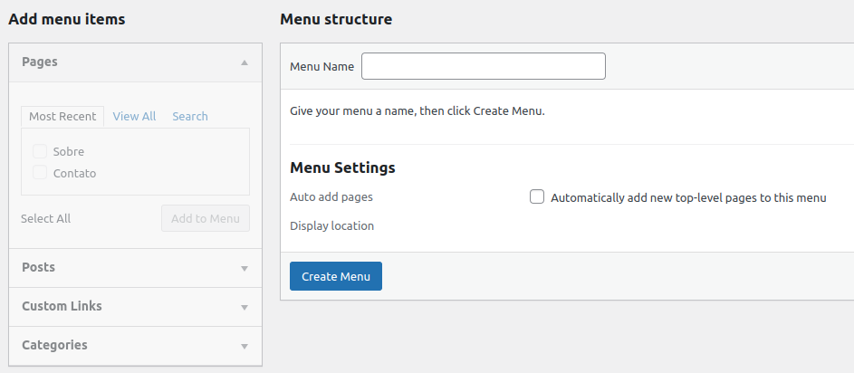
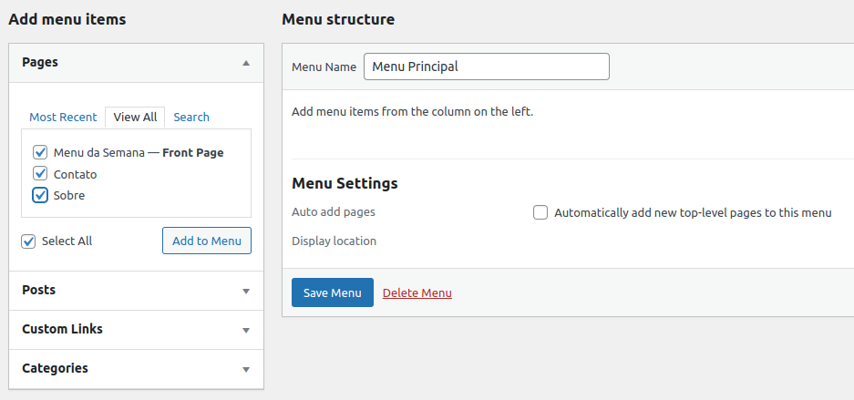
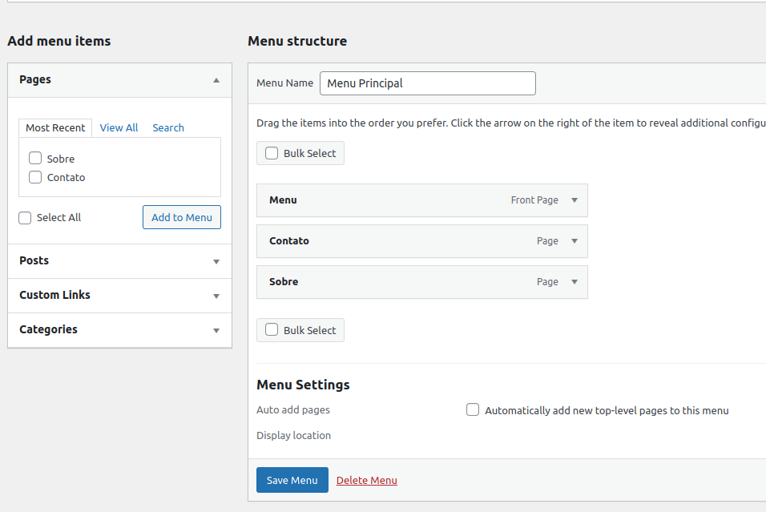

### Configuração de tela inicial

Se abrir o site agora vera que já possivel visualizar o template, contudo a pagina inicial só vai possuir o header da aplicação, sem conteudo, já que no momento a pagina inicial esta como sendo o arquivo **index.php**, mas o correto seria estar apontando para o **page-home.php** que é a pagina do Menu da Semana.

Para corrigir isso dentro de **Settings -> Reading** disponivel no menu lateral, vamos mudar a configuração para a pagina inicial ser a que queremos.

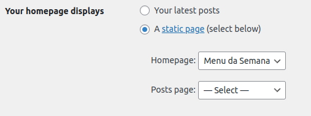

## Usando Theme

Com tudo configurado é possivel agora acessar a aba de Pages e dentro de cada page verificar que possuem campos para serem preenchidos e que o conteudo do que for preenchido neles sera exibido no site.

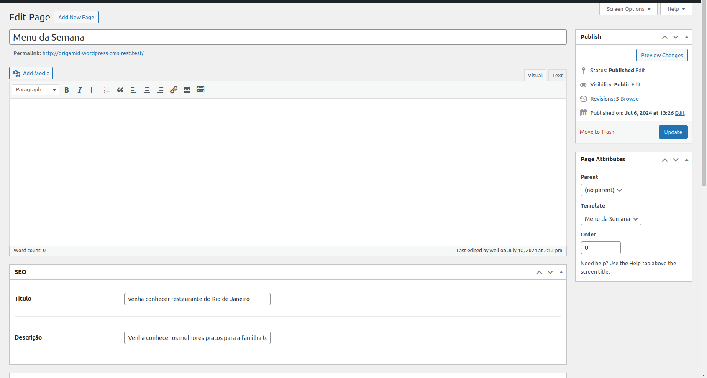
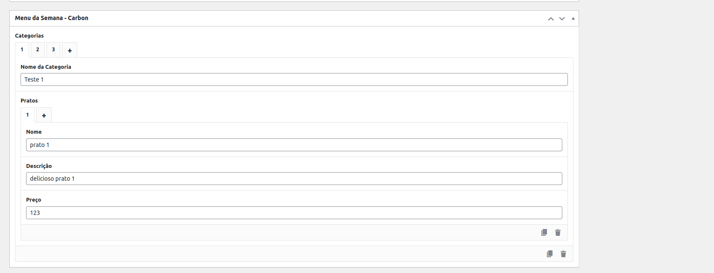
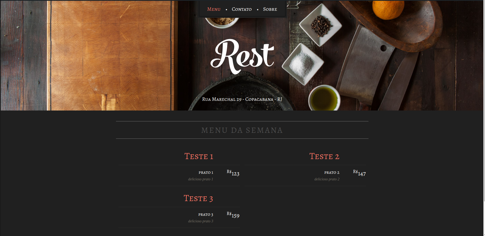

## Tecnologias

- **PHP** - É a linguagem de programação compreendida pelo Wordpress.
- **HTML** - Linguagem markdown para contrução do site.
- **CSS** - Estilização do site.
